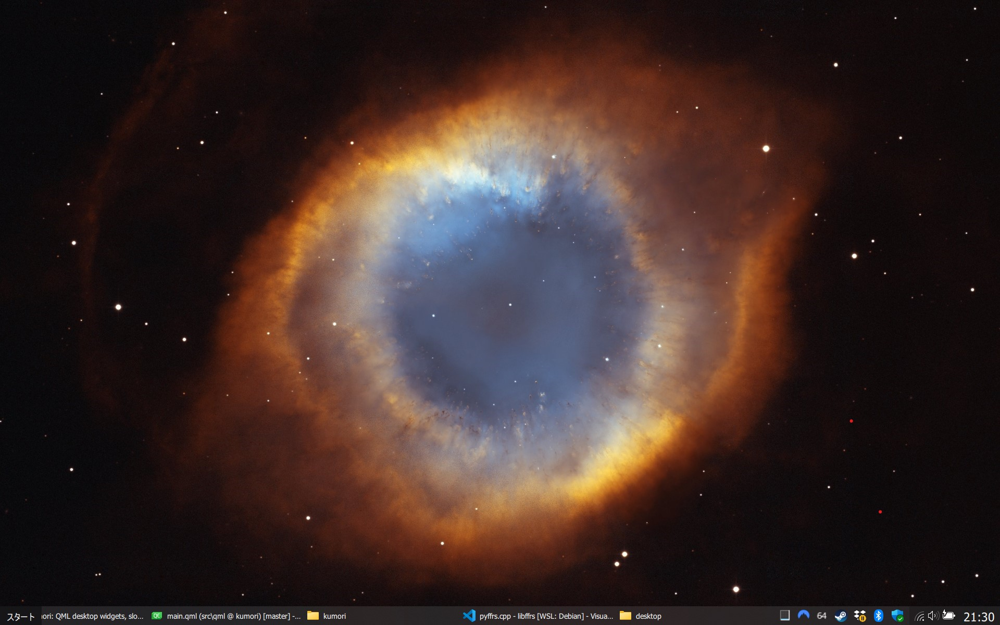

☁️ kumori
==========

My initial objective was to use GPU shaders as wallpapers on Windows like I used to in KDE,
and after the upgrade to Windows 11 I decided to also replace the default taskbar.

I can't overstate my disdain for the default Windows 11 taskbar, it's less customizable and eats 72 pixels,
almost 7% of the total size of a full HD screen, while providing so. little. value.

As of Feb. 2024 **kumori**'s taskbar implements the bare minimum, including the window list, system tray, and action center icons.
Despite it's quirks, the taskbar is in a good enough state that I prefer it over Windows 11's.

Customization
-------------

To change the appearance/behavior, edit the file `Documents/kumori/main.qml`.
The default script will replace the Windows taskbar with [`Taskbar.qml`](./src/qml/kumori/Taskbar.qml).

You can create additional QML components in the same folder, but you need to instantiate them from `main.qml`.

E.g.: copy the original [`Taskbar.qml`](./src/qml/kumori/Taskbar.qml) located in `<kumori>/qml/kumori/` to `Documents/kumori/` with the name `CustomTaskbar.qml`
\
And then in `main.qml`:

    import kumori 0.1
    
    CustomTaskbar {
        id: root
    }

**kumori** tries to monitor the config folder for changes and will reload automatically when the source files are edited.

Some useful links to learn more about QML:
  - [First Steps with QML](https://doc.qt.io/qt-5/qmlfirststeps.html)
  - [All QML Types](https://doc.qt.io/qt-5/qmltypes.html)

Multi-monitor support
---------------------

**kumori** \*does not\* support multiple monitors yet, the taskbar and any widgets might behave erraticaly.

If I get a second monitor that will become a priority, but not plans for now.

Fell free to open a pull request in the mean time ;)

Debugging
---------

If **kumori** encounters an error while parsing the .qml files, all components will be disabled.

You can use Microsoft's [DebugView](https://learn.microsoft.com/en-us/sysinternals/downloads/debugview) to see the logs during the app execution, the logs will also contain any QML error messages.

Thanks
------

Part of this project would not have been possible without the tricks I learned from https://github.com/cairoshell/ManagedShell
